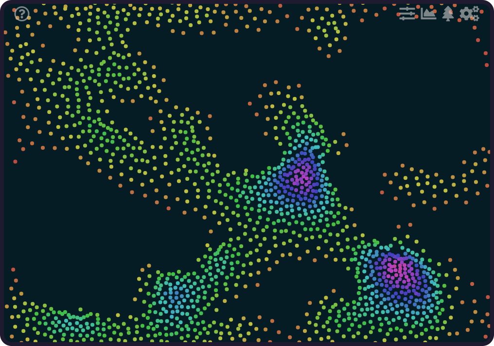

# Quelea | A Boids Simulation
[Live Link](https://quelea-boids.herokuapp.com/#/)

<p align="center"></p>

## Overview
A simulation of boidian behavior exhibited by flocking, swarming, herding, swimming, or flying animals

## Features
Users can add/remove boids and obstacles, set sliders for the simulation variables, show/hide underlying structures and rules that guide the boids, and step through a boid's behavior.
<div display="flex" flex-direction="row">
  
  
  
  
  
  
</div>

## Intention
Flocking behavior is often poorly understood but nevertheless an interesting and valuable simulation, having uses in swarm automation and AI, other more complex data visualizations, Biology, computer graphics, video game development, etc.  A basic visual guide with references to each of the steps can be invaluable in reproducing the effect in any number of projects.

At then end of the interactive demonstration, users
should be able to understand the three primary guiding
forces behind boids: **seperation**, **alignment**, and **cohesion**, as well the variables and their effect on the three guiding forces.

## Use
You can find a brief summary of the application, the algorithm's history, and its inner workings under the question icon
within the main window of the simulation, on the left. All other controls and features can be found as drop-downs
from the icons on the right side of the same window.  There are pop-up tooltips for each feature/option and hovering
over the name of each option will reveal them.

## Technologies
* Javascript
* React
* HTML5 Canvas

### Purpose Built Libraries
* Euclidian Geometry
* Vectors
* Boidian/Particle Motion
* Physics
* Quadtree Algorithm

## Features, Implementation, Snippets
Excluding React, all features and code take full advantage of vanilla JavaScript
and the HTML5 Canvas.  All additional libraries were purpose built for the demonstration.

### Vectors
The vector library is a simplified 2D vector class.  Most none-static methods
can be chained to together to perform sequences of operations while saving code space.
This code could be greatly expanded upon should the need arise to include 3 or more dimensions,
cross-products, matrix solutions, or other useful vector products.
```js
// Create two vectors
let vec1 = new Vec(1, 3);
let vec2 = new Vec(3, 5);

// Chain together a sequence of vector operations
vec1.add(vec2).scale(1.5).limit(3);
// result sequence: vec1 -> {x: 4, y: 8} -> {x:6, y:12} -> {x:1.34, y:2.68}

// Non-exhaustive list of examples
vec2.getHeading(); // returns heading in radians
vec2.distTo(vec1); // returns euclidian distance between vectors
let vec3 = Vec.sub(vec2, vec1); // subtracts vec1 from vec2 and returns a new vec without changing original
Vec.angleBetween(vec1, vec3); // returns angle between vectors in radians
```
##### Included Vector operations: 
    set, copy, getHeading, getNorm, distTo, normalize, scale, limit, div, add, sub,
    setMag, newUnit, Vec.sub, Vec.scale, Vec.randUnit, Vec.unitFrom, Vec.scalar,
    Vec.angleBetween, Vec.randFromMag
  
### Boid And Swarm
Boid and Swarm collectively work together to perform the simulation.  The Boid class contains its vectors
and methods for interacting with other boids, including the `ascFunc` responsible for the three behaviors it exhibits.
The Swarm class contains configuration settings, a Quadtree, and the array of boids, and peforms en-masse operations such as updating all boids for the next frame, drawing boids to the canvas, adding/removing boids and obstacles, etc.
The Swarm class currently does not come complete, and needs a few initial variables when instaniated, including width
and height of the canvas, and a boidIcon to draw should that `drawType` be requested.
```js
  // Create a swarm
  let new swarm = new Swarm();
  swarm.newSwarm(1500, width, height) // Create a random collection of 1500 boids
  swarm.swarm(width, height) // Build quadtree and perform boid.ascFunc for each boid
  swarm.swarmWrap(width, height) // wrap swarm around canvas boundary
  swarm.drawSwarmAdv(ctx) // draw boids to canvas 
```
Some interesting behavior for the Swarm class is that the swarm size you add with `newSwarm(swarmSize, width, height)`
is the maximum anticipated swarm size you need.  By setting `swarm.size` after the fact, the swarm functions will automatically only operate on/draw that many boids.  This is a performance optimization whereby the original array is
left as is, without fragmentation, and setting new swarm sizes within the app can happen instantly each frame.
Another optimization is predefining and then filling arrays for each call to swarm.  Changes are merged back into
the original boids array.  These optimizations are demonstrated in the snippet below and are found elsewhere as well.
```js

Class Swarm(...) {
  constructor(...)
    ...

 swarm(width, height) {
    let boidsNext = new Array(this.size); // using

    const max = Math.max(this.alignmentR, this.cohesionR, this.separationR);
    const field = new Rect(width / 2, height / 2, width / 2, height / 2);
    let boidsQT = new QuadTree(field, 8);
    for (let boid of this.activeBoids()) {
      boidsQT.insert(boid)
    }

    for (let i = 0, len = this.size; i < len; i++) {
      let neighborArea = new Rect(this.boids[i].pos.x, this.boids[i].pos.y, max, max);
      let obsArea = new Rect(this.boids[i].pos.x, this.boids[i].pos.y, this.avoidanceR, this.avoidanceR);

      let neighborQuery = boidsQT.query(neighborArea);
      let obsQuery = this.obsQT.query(obsArea);

      boidsNext[i] = this.boids[i].acsFunc(this, neighborQuery, obsQuery);
      boidsNext[i].update(this);
    }

    Object.assign(this.boids, boidsNext);
  }
}
```
The Boid class is largely just its `ascFunc` method, which is a combined function for its alignment, separation, and cohesion
behaviors.  Here's a snippet of JUST the alignment and avoidance portion for brevity.
```js
Class Boid(...) {

  acsFunc(swarm, boids, obstacles) {
    let alignmentAvg = new Vec();
    let alignmentAffectedBy = 0;
    ... // other variables removed for brevity
    let falloff;


    let dist;
    for (let boid of boids) {
      // alignment
      dist = boid.pos.distTo(this.pos);
      falloff = swarm.alignmentFalloff(dist);
      if (falloff > 0) {
        alignmentAvg.add(boid.vel);
        alignmentAffectedBy += 1;
      }

      // separation
      ...

      // cohesion
      ...
    }

    // Avoidance
    let avoidAvg = new Vec();
    for (let obs of obstacles) {
      falloff = swarm.avoidanceFalloff(this, obs);
      if (falloff > 0) {

        sepDiff = Vec.sub(this.pos, obs.pos);
        if (Vec.angleBetween(this.vel, sepDiff) <= swarm.minApproachAngle) {
          avoidAvg.add(sepDiff.div(falloff * falloff));
          avoidAffectedBy += 1;
        }
      }
    }

    // alignment
    if (alignmentAffectedBy > 0) {
      alignmentAvg
        .setMag(swarm.maxSpeed)
        .sub(this.vel)
        .limit(swarm.maxAF)
    }
    // separation
    ...
    // cohesion
    ...

    // Avoidance
    if (avoidAffectedBy > 0) {
      avoidAvg
        .div(avoidAffectedBy)
        .setMag(swarm.maxSpeed)
        .sub(this.vel)
        .limit(swarm.maxAvF)
    }
    let newBoid = new Boid(
      this.pos, 
      this.vel, 
      alignmentAvg
        .add(cohesionAvg)
        .add(seperationAvg)
        .add(avoidAvg)
        .scale(swarm.maxAcc)
    );
    newBoid.avgNeighbors = (alignmentAffectedBy + cohesionAffectedBy + separationAffectedBy) / 3;
    return newBoid
  }

}
```
### Quadtree
The level of performance for this app hinges on its use of a quadtree.  A naive implementation of the
boid algorithm takes a boid and calculates the difference between it and every single boid on the field.
This results in O(N^2) and for just 100 boids means 10,000 checks for neighbors, at the 1,500 boid maximum of this
application, that would mean 2.25 million neighbor checks, per frame.  

This application uses a simple Point-Region Quadtree to recursively divide and branch the field in a two-dimensional binary
search tree.  It can then be queried locally for only that area relevant to any one boid on the field.  For this
application that means O(N Log(N)) timing, reducing millions of checks to less than 5000 (on average) per frame.

You can see above in the Swarm code snippet that the quadtree for the boids is cheap enough computationally to be
recreated each frame rather than track boids across quadtree boundaries.  The quadtree implementation itself is simple
and only featured enough for this particular application.  More sophisticated uses within the app simply require extending
the class or modifying small portions of code.  Some of the same performance optimizations such as array preallocation
are found in this class as well.  It also relies on a Rect class used to track the boundary of each node/leaf contained in 
the tree.  Here's the class in its entirety.

```js
class QuadTree {
  constructor(bounds, n) {
    this.bounds = bounds;
    this.cap = n;
    this.objects = new Array(n);
    this.numPoints = 0;
    this.divided = false;
  }

  subdivide() {
    let { x, y, w, h } = this.bounds;
    w = w/2;
    h = h/2;
    this.q1 = new QuadTree(
      new Rect(x + w, y - h, w, h ),
      this.cap
    );
    this.q4 = new QuadTree(
      new Rect(x + w, y + h, w, h),
      this.cap 
    );
    this.q3 = new QuadTree(
      new Rect(x - w, y + h, w, h),
      this.cap
    );
    this.q2 = new QuadTree(
      new Rect(x - w, y - h, w, h),
      this.cap
    );

    this.divided = true;
  }

  insert(object) {
    if (!this.bounds.contains(object)) return false;

    if (this.numPoints < this.cap) {
      this.objects[this.numPoints] = object;
      this.numPoints++;
      return true;
    }
    if (!this.divided) {
      this.subdivide();
    }

    if (
      this.q1.insert(object) ||
      this.q4.insert(object) ||
      this.q3.insert(object) ||
      this.q2.insert(object)
    ) return true;
  }

  sever() {
    this.numPoints = 0;
    this.divided = false;
  }

  query(range, found = []) {
    if (!range.intersects(this.bounds)) return found
      for (let i = 0; i < this.numPoints; i++) {
        if (range.contains(this.objects[i])) found.push(this.objects[i]);
      }

      if (this.divided) {
        this.q1.query(range, found);
        this.q4.query(range, found);
        this.q3.query(range, found);
        this.q2.query(range, found);
      }
      return found; 
  }

}
```
### Swarm Configuration
Here's a quick look at the configuration file for the Swarm in its intial state.  The swarm can also receive
a custom config upon instantiation and should be in this form if done so.  Note that the falloff functions are either
constant or linear falloff here.  Users can change them however they like to add sophistication to the boid's behavior.
```js
const CONFIG = () => {
  return {
    alignmentR: 25,
    cohesionR: 50,
    separationR: 24,
    avoidanceR: 50,
    maxAF: 0.3,
    maxCF: 0.2,
    maxSF: 0.4,
    maxAvF: 0.75,
    maxSpeed: 3,
    maxAcc: 1,
    size: 0,
    boidIcon: null,
    boidIconSize: 10,
    drawType: "drawSwarm",
    minApproachAngle: 3*Math.PI/5,
    alignmentFalloff: function (dist) {
      if (dist < this.alignmentR && dist > 0) return 1;
      else return 0;
    },
    cohesionFalloff: function (dist) {
      if (dist < this.cohesionR && dist > 0) return 1;
      else return 0;
    },
    separationFalloff: function (dist) {
      if (dist < this.separationR && dist > 0) return dist;
      else return 0;
    },
    avoidanceFalloff: function (boid, obs) {
      const dist = boid.pos.distTo(obs.pos);
      if (dist < this.avoidanceR) return dist;
      else return 0;
    }
  }
}
```

## To-do
* Add Falloff page - User controls that allow selecting different falloff curves
  for the various perception radii within the app
* Add the ability to select different backgrounds and display styles
* Add canvas resizing (currently fixed width/height)
