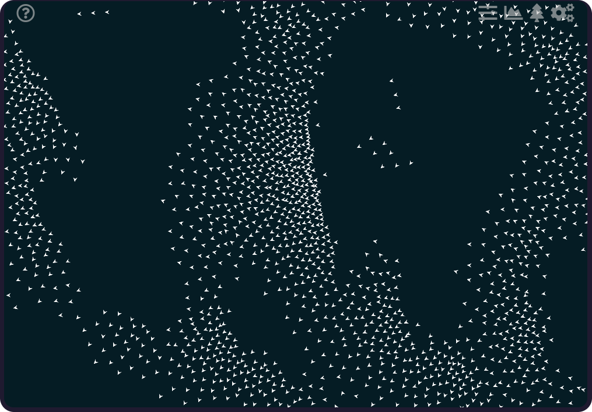
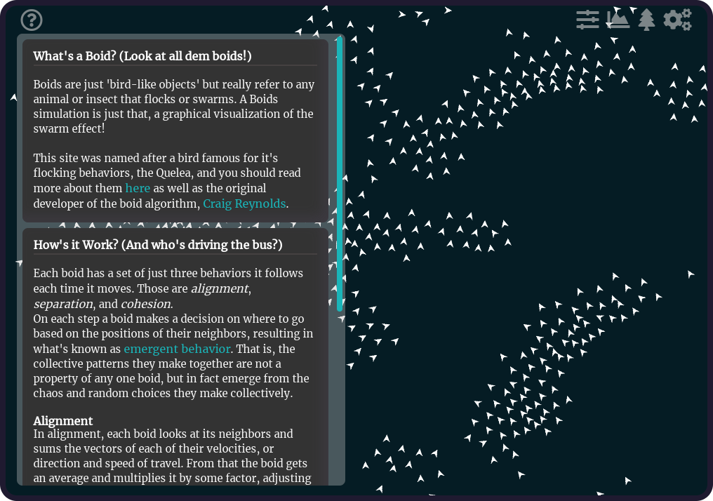
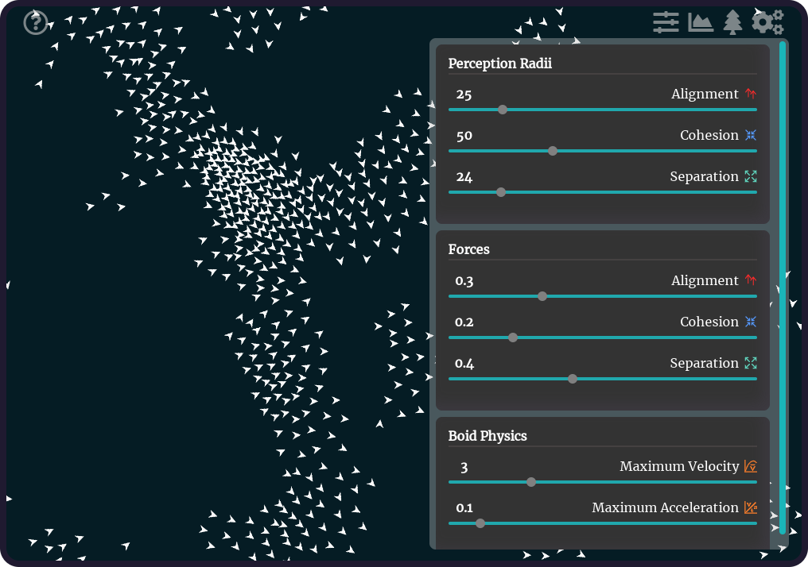
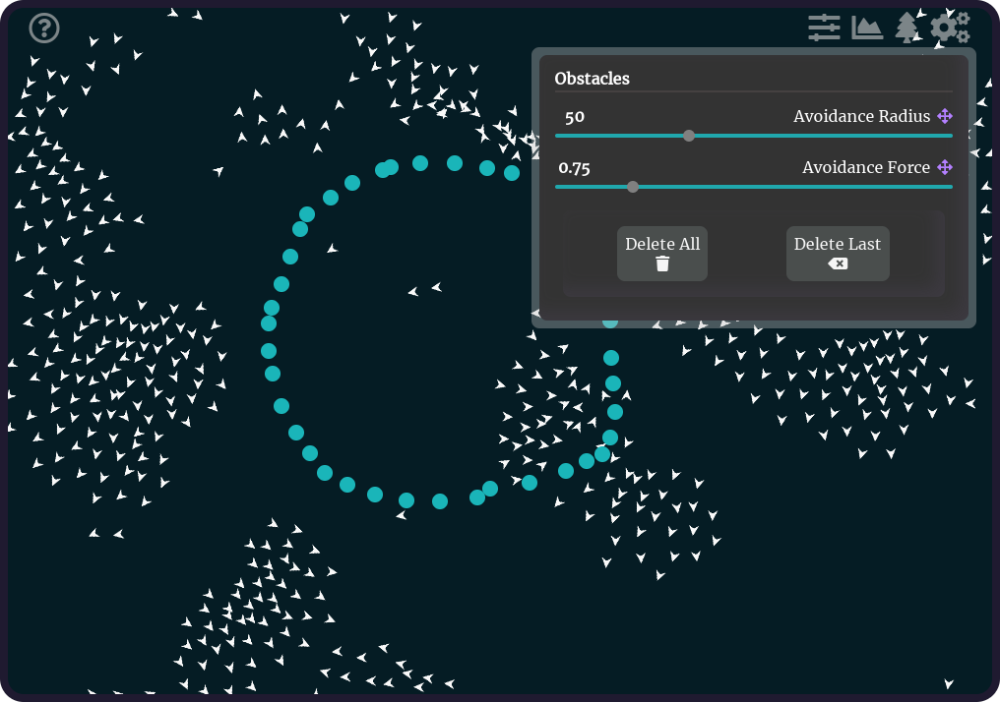
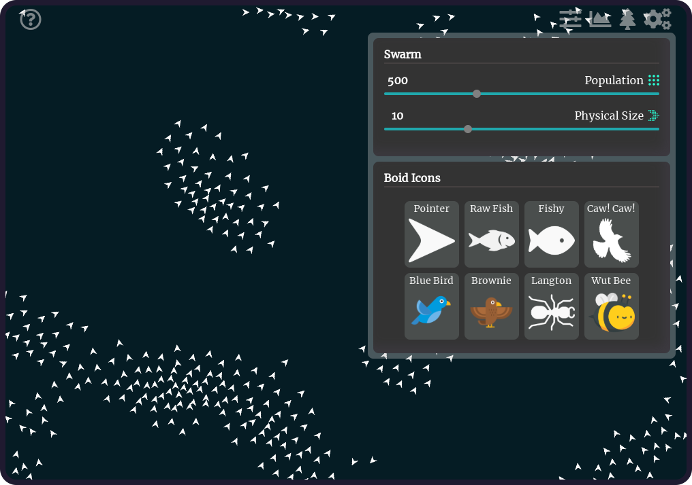
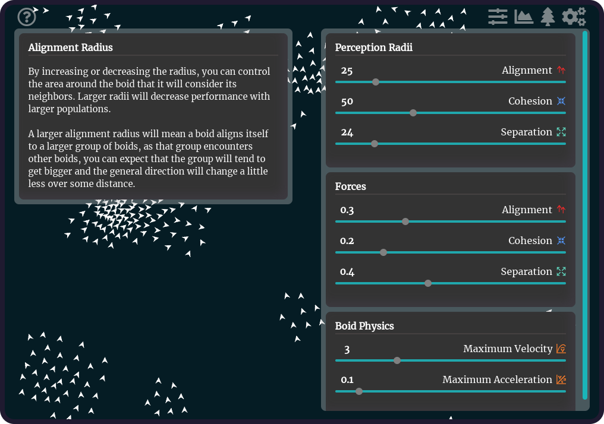

# Quelea | A Boids Simulation
[Live Link](https://dashboard.heroku.com/apps/quelea-boids)

## Overview
A simulation of boidian behavior exhibited by flocking, swarming, herding, swimming, or flying animals

## Features
Users can add/remove boids and obstacles, set sliders for the simulation variables, show/hide underlying structures and rules that guide the boids, and step through a boid's behavior.

  
  
  
  
  
  

## Intention
Flocking behavior is often poorly understood but nevertheless an interesting and valuable simulation, having uses in swarm automation and AI, other more complex data visualizations, Biology, computer graphics, video game development, etc.  A basic visual guide with references to each of the steps can be invaluable in reproducing the effect in any number of projects.

At then end of the interactive demonstration, users
should be able to understand the three primary guiding
forces behind boids: **seperation**, **alignment**, and **cohesion**, as well the variables and their effect on the three guiding forces.

## Technologies
* Javascript
* React
* HTML5 Canvas

### Purpose Built Libraries
* Euclidian Geometry
* Vectors
* Boidian/Particle Motion
* Physics
* Quadtree Algorithm
